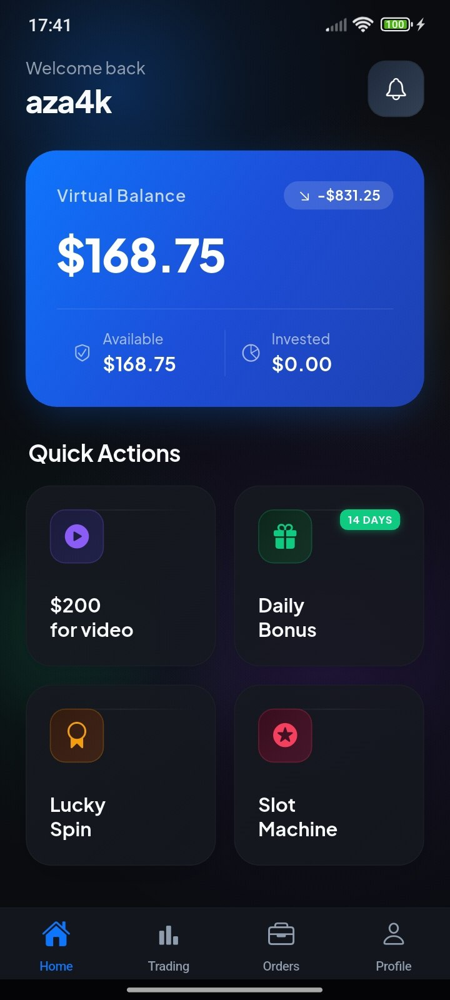
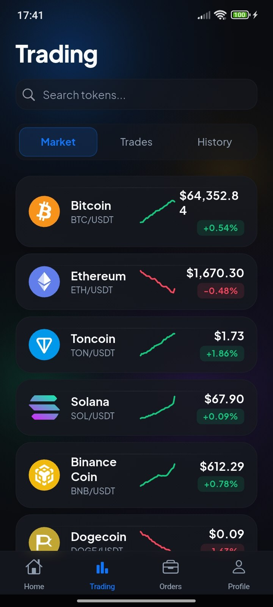
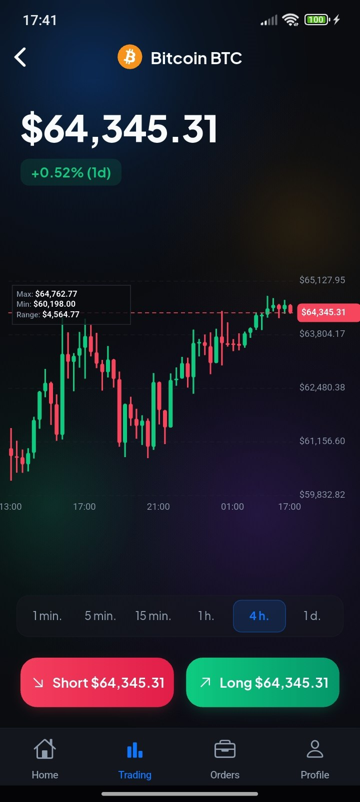
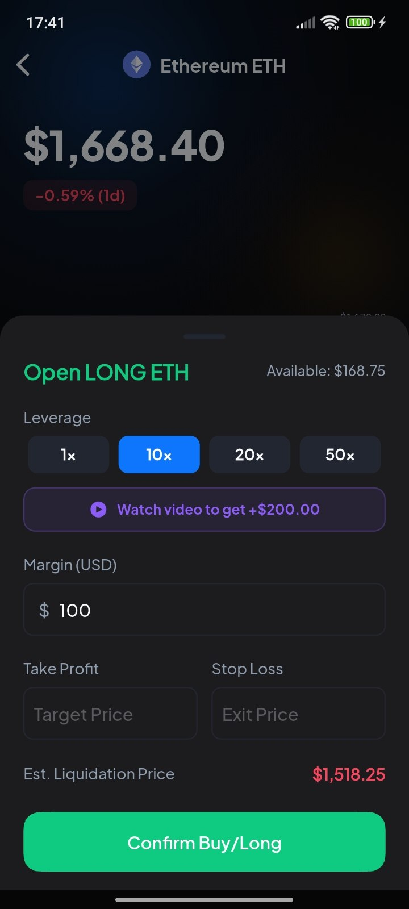
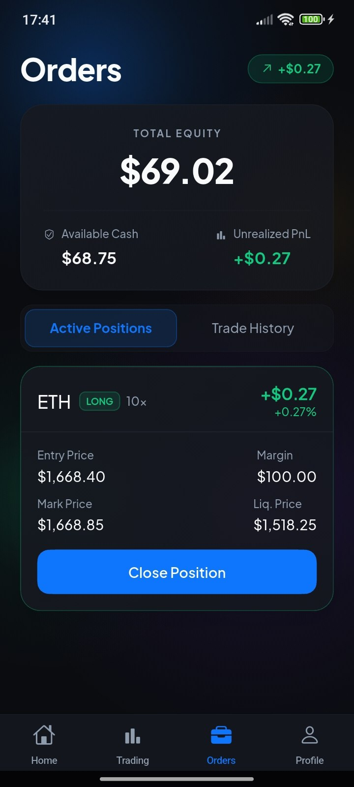
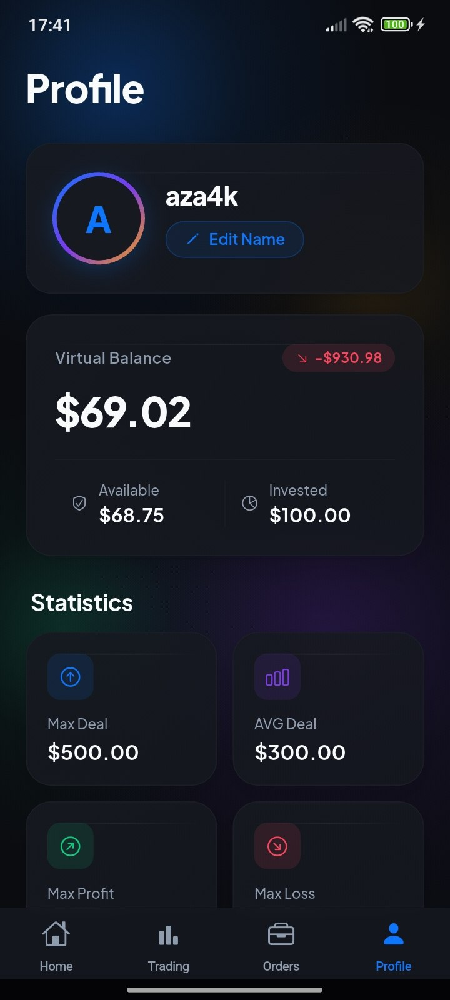

<div align="center">
<br/>

```
███████╗██╗   ██╗███╗   ██╗████████╗██████╗  █████╗ ██████╗ ███████╗
██╔════╝██║   ██║████╗  ██║╚══██╔══╝██╔══██╗██╔══██╗██╔══██╗██╔════╝
█████╗  ██║   ██║██╔██╗ ██║   ██║   ██████╔╝███████║██║  ██║█████╗
██╔══╝  ██║   ██║██║╚██╗██║   ██║   ██╔══██╗██╔══██║██║  ██║██╔══╝
██║     ╚██████╔╝██║ ╚████║   ██║   ██║  ██║██║  ██║██████╔╝███████╗
╚═╝      ╚═════╝ ╚═╝  ╚═══╝   ╚═╝   ╚═╝  ╚═╝╚═╝  ╚═╝╚═════╝ ╚══════╝
```

**— Learn Crypto Trading. Risk Nothing. Win Everything. —**

<br/>

[](https://github.com/aza4k/funtrade)
[](https://flutter.dev)
[](https://dart.dev)
[](https://pub.dev/packages/provider)
[](https://admob.google.com)
[](LICENSE)

</div>

<br/>

> [!NOTE]
> A **100% risk-free** crypto trading simulator — real market prices, virtual capital, gamified mechanics. No real money. Ever.

<br/>

## Screenshots

<div align="center">
  
  
  

  
  
</div>

<br/>

---

<br/>

## · The Idea ·

Most people are afraid to try crypto trading because one wrong move costs real money. **FunTrade** removes that fear — connect to live market data, trade with virtual capital, and learn through real mechanics: Long/Short positions, Stop-Loss, Take-Profit, PnL tracking. When you're bored of the charts, spin the slot machine.

```
Open app  →  Watch live prices  →  Open trade  →  Track PnL  →  Close & repeat
```

<br/>

---

<br/>

## · Architecture ·

Layered architecture — service calls flow up, state flows down, UI just watches.

```
╔══════════════════════════════════════════════════════════════╗
║                        UI LAYER                              ║
║                                                              ║
║  [ Home ]  [ Trading ]  [ Profile ]  [ Slot Machine ]        ║
║      │           │           │             │                 ║
║      └───────────┴───────────┴─────────────┘                 ║
║                        watches                               ║
╚══════════════════════════╤═══════════════════════════════════╝
                           │  notifyListeners()
╔══════════════════════════╧═══════════════════════════════════╗
║                    PROVIDER LAYER                            ║
║                                                              ║
║   ┌─────────────────────┐   ┌──────────────────────────┐    ║
║   │   MarketProvider    │   │    PortfolioProvider     │    ║
║   │                     │   │                          │    ║
║   │  · Fetch prices     │──▶│  · Open / Close trade   │    ║
║   │  · Periodic refresh │   │  · PnL calculation       │    ║
║   │  · Notify UI        │   │  · Stop-Loss / TP logic  │    ║
║   └──────────┬──────────┘   └────────────┬─────────────┘    ║
╚══════════════╪══════════════════════════  ╪ ════════════════╝
               │  calls                    │ reads/writes
╔══════════════╧══════════════════════════  ╧ ════════════════╗
║                    SERVICE LAYER                             ║
║                                                              ║
║  CryptoApiService   StorageService   AdService               ║
║  Live prices        SharedPrefs      Banner/Interstitial      ║
║                                                              ║
║  NotificationService                                         ║
║  Price alerts · Daily bonus reminders                        ║
╚══════════════════════════════════════════════════════════════╝
```

<br/>

---

<br/>

## · Data Models ·

<details>
<summary><b>AssetPrice</b> — live market snapshot</summary>
<br/>

| Field | Type | Notes |
|---|---|---|
| `symbol` | String | Ticker (BTC, ETH…) |
| `name` | String | Full name |
| `price` | double | Current market price |
| `change24h` | double | 24h change % |

</details>

<details>
<summary><b>Position</b> — an open trade</summary>
<br/>

| Field | Type | Notes |
|---|---|---|
| `asset` | String | Which crypto |
| `direction` | Enum | `Long` or `Short` |
| `entryPrice` | double | Price at open |
| `size` | double | Virtual capital |
| `stopLoss` | double? | Auto-close on loss |
| `takeProfit` | double? | Auto-close on profit |
| `openedAt` | DateTime | Timestamp |

</details>

<details>
<summary><b>TradeHistory</b> — closed position record</summary>
<br/>

| Field | Type | Notes |
|---|---|---|
| `position` | Position | Original trade |
| `exitPrice` | double | Price at close |
| `pnl` | double | Final profit / loss |
| `closedAt` | DateTime | Timestamp |

</details>

<br/>

---

<br/>

## · Trading Logic ·

How a trade lives and dies:

```
1. OPEN
   User taps Buy/Sell
   └─ PortfolioProvider.openTrade(asset, direction, size)
      └─ entryPrice recorded
         └─ size deducted from virtual balance
            └─ StorageService.save()

2. LIVE
   MarketProvider ticks every 5s
   └─ PortfolioProvider.onPriceUpdate(newPrice)
      └─ PnL = (currentPrice − entryPrice) × size
         └─ Check Stop-Loss / Take-Profit
            └─ Auto-close if threshold crossed → go to step 3

3. CLOSE
   User taps Close (or SL/TP triggers)
   └─ PortfolioProvider.closeTrade(position)
      └─ Final PnL added to balance
         └─ TradeHistory entry created
            └─ StorageService.save()
```

<br/>

---

<br/>

## · Gamification ·

```
🎰  Slot Machine     Spin 3 reels — matching symbols award virtual coins
🎡  Lucky Spin       Daily wheel with weighted prize sections
🚀  Shuttle Game     Interactive mini-game tied to live price movement
🎁  Daily Bonus      Incremental rewards for consecutive login streaks
🔔  Price Alerts     Push notifications pull users back on big moves
```

All rewards are virtual currency, persisted locally via `StorageService`.

<br/>

---

<br/>

## · Stack ·

```
Framework      Flutter 3.x  ·  Dart 3.x
State          Provider
Storage        SharedPreferences
Networking     http
Charts         fl_chart  (candlestick OHLC)
Maps           —
Monetization   Google Mobile Ads (Banner + Interstitial)
Notifications  flutter_local_notifications
Design         Glassmorphism  ·  LiquidBackground animations
```

<br/>

---

<br/>

## · Quick Start ·

```bash
git clone https://github.com/aza4k/funtrade.git && cd funtrade

flutter pub get

# Set your API source in lib/core/services/crypto_api_service.dart:
# const String apiBaseUrl = 'https://api.coingecko.com/api/v3';

# Add AdMob App ID to AndroidManifest.xml / Info.plist

flutter run
```

> [!WARNING]
> Never use real financial data to make actual investment decisions based on this app. It is a simulator only.

<br/>

---

<br/>

## · Project Structure ·

```
lib/
├── core/
│   ├── services/
│   │   ├── crypto_api_service.dart       ← live price fetching
│   │   ├── storage_service.dart          ← SharedPreferences
│   │   ├── ad_service.dart               ← AdMob
│   │   └── notification_service.dart     ← push notifications
│   └── theme/
│       └── app_theme.dart                ← Glassmorphism tokens
├── models/
│   ├── asset_price.dart
│   ├── position.dart
│   └── trade_history.dart
├── providers/
│   ├── market_provider.dart              ← live price state
│   └── portfolio_provider.dart           ← trading logic & balance
├── screens/
│   ├── home_screen.dart
│   ├── trading_screen.dart
│   ├── profile_screen.dart
│   └── slot_machine_screen.dart
├── widgets/
│   ├── candlestick_chart.dart
│   ├── glass_card.dart
│   └── liquid_background.dart
└── main.dart
```

<br/>

---

<br/>

<div align="center">

MIT License · © [aza4k](https://github.com/aza4k)

<br/>

Developed by **[fundev](https://fundev.uz)** Team

</div>